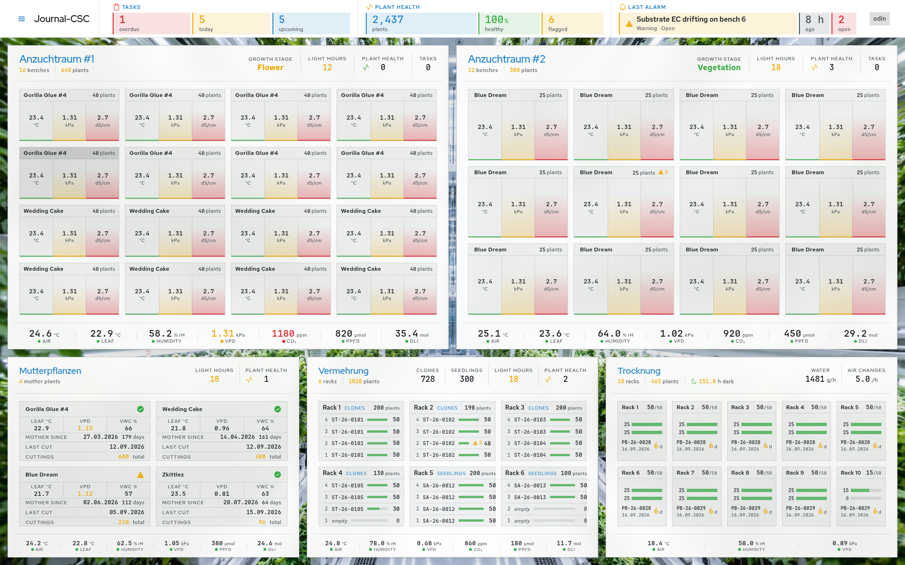
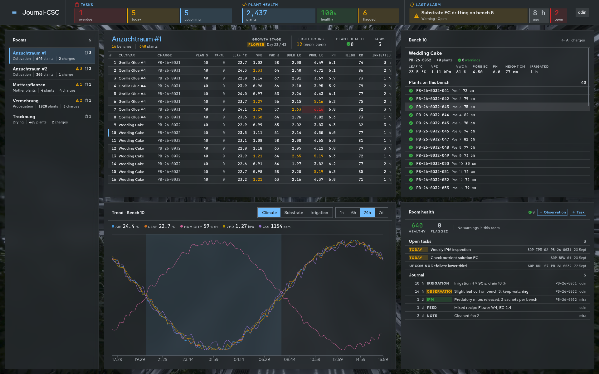
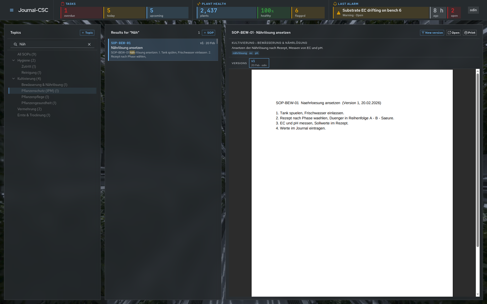

# journal-csc — Code-Ausschnitte

`journal-csc` ist ein selbst entwickeltes Dashboard zur Raum- und Chargenverwaltung für
den kontrollierten Indoor-Anbau (Cannabis-Industrie): Kultivierungs-, Mutterpflanzen-,
Vermehrungs- und Trocknungsräume mit Bankplänen, Sollwerten (u. a. VPD), Trends und
Aufgaben. React/TypeScript-Frontend, aufgebaut auf der gemeinsamen `carbide-ui`-Basis.
Kuratierte Auswahl aus einem privaten, aktiven Repository (94 Commits) — Ausschnitte,
kein vollständiger Quellcode.

## Screenshots

*Alle Raumtypen auf einen Blick: Kultivierung, Mutterpflanzen, Vermehrung, Trocknung — jeweils mit Live-Sollwerten pro Bank/Rack.*

*Detailansicht eines Kultivierungsraums: Chargen-Tabelle, Bank-Detail mit Pflanzenliste, Klimaverlauf und Raum-Journal.*

*Durchsuchbare Standardarbeitsanweisungen (SOPs), versioniert und nach Thema sortiert.*

## Enthaltene Ausschnitte

| Datei | Zeigt |
|---|---|
| `components/bench-grid/BenchGridCR.tsx` (+ CSS Module) | Bankplan-Raster eines Kultivierungsraums — Kern der Raumansicht |
| `components/bench-grid/CultivationRoom.tsx` (+ CSS Module) | Raumkomponente, die BenchGrid mit Chargen-/Sollwertdaten zusammenführt |
| `components/bench-grid/Room.tsx` (+ CSS Module) | Gemeinsame Basis-Raumkomponente, die von den verschiedenen Raumtypen (Kultivierung, Mutterpflanzen, Vermehrung, Trocknung) wiederverwendet wird |
| `pages/rooms/Rooms.tsx` | Einstiegspunkt der Rooms-Ansicht: Raumliste + Detailbereich |
| `pages/rooms/RoomTable.tsx` (+ CSS Module) | Tabellarische Übersicht einer Charge mit Live-Messwerten (Blatttemperatur, VPD, Warnungen) |
| `pages/rooms/RoomDashboard.tsx` | Dashboard-Zusammenstellung pro Raum (Kennzahlen, Trend, Journal, Aufgaben) |

## Architektur-Idee

Jeder Raumtyp (Kultivierung, Mutterpflanzen, Vermehrung, Trocknung) ist eine eigene
Komponente, die dieselbe `Room`-Basis und dieselben `carbide-ui`-Bausteine (DataGrid,
Charts) nutzt, statt Fachlogik zu duplizieren. Die UI-Bibliothek (`carbide-ui`) und diese
App teilen sich damit denselben Werkzeugkasten — ein Grund, warum ich sie als eigenes
Package ausgelagert habe statt sie in jeder App neu zu bauen.
